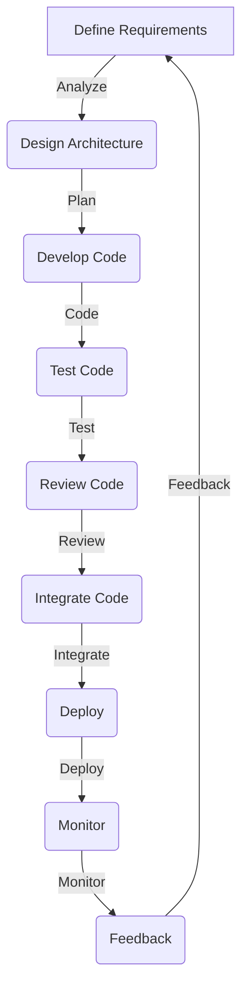

```mermaid
flowchart TD; A[Define Requirements] -->|Analyze| B(Design Architecture); B -->|Plan| C(Develop Code); C -->|Code| D(Test Code); D -->|Test| E(Review Code); E -->|Review| F(Integrate Code); F -->|Integrate| G(Deploy); G -->|Deploy| H(Monitor); H -->|Monitor| I(Feedback); I -->|Feedback| A;
```
