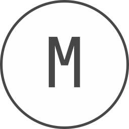

**About me**

- 💼 I worked as a Software Engineer and Systems Analyst

- 📈 What I am currently doing | learning | keeping myself busy are:

  > **Training for** Junior Cybersecurity Analyst certification 🚧
  > Coding 👨‍💻
  > Ethical hacking and smashing Arduino device

- ❤️ I love writing programs, study cybersecurity and building fun experiments

- I am straightforward.

- 💬 Take a look at my [portfolio here](https://arcpac.github.io/)

<h2 align="left" id="macropower-tech">My Hacking LAB</h2>

> I am a cyber security enthusiast and I play with the following tools.

<table>
  <tr>
    <td align="center" width="96">
      
       Linux
    </td>
    <td align="center" width="96">
      
       Burp Suite
    </td>
    <td align="center" width="96">
      
       Wireshark
    </td>
    <td align="center" width="96">
      
       Kali Linux
    </td>
    <td align="center" width="96"> 
      
       NMAP
    </td>
  </tr>
</table>

<h2 align="left" id="macropower-tech">Software Development</h2>

> I build web applications using these tools

<table>
  <tr>
    <td align="center" width="96">
      
       NodeJS
    </td>
    <td align="center" width="96">
      
       ReactJS
    </td>
    <td align="center" width="96">
      
       JavaScript
    </td>
    <td align="center" width="96">
      
       MERN
    </td>
    <td align="center" width="96"> 
      
       PHP
    </td>
    <td align="center"  width="96">
         
       Git
    </td>
    <td align="center" width="96">
      
       NodeRED
    </td>
  </tr>
</table>

<h2 align="left" id="macropower-tech">Education</h2>

  
